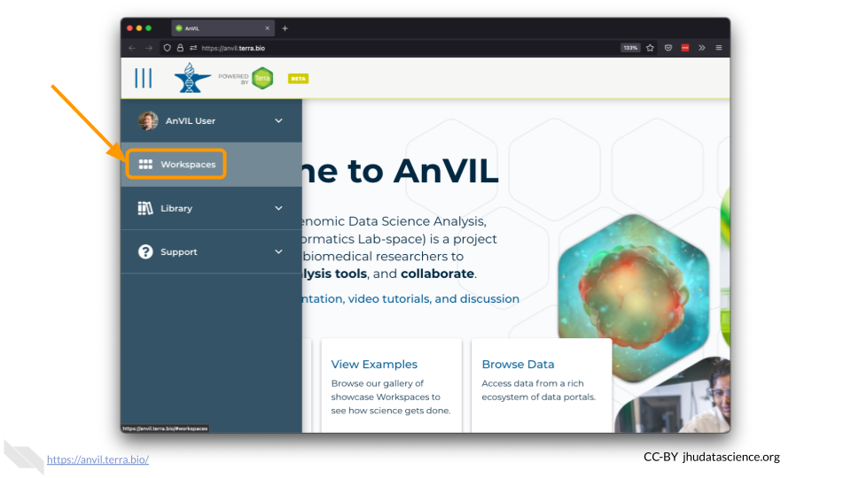
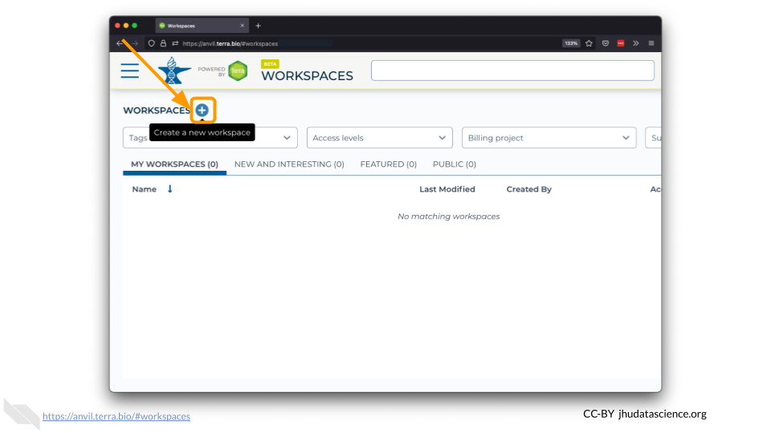
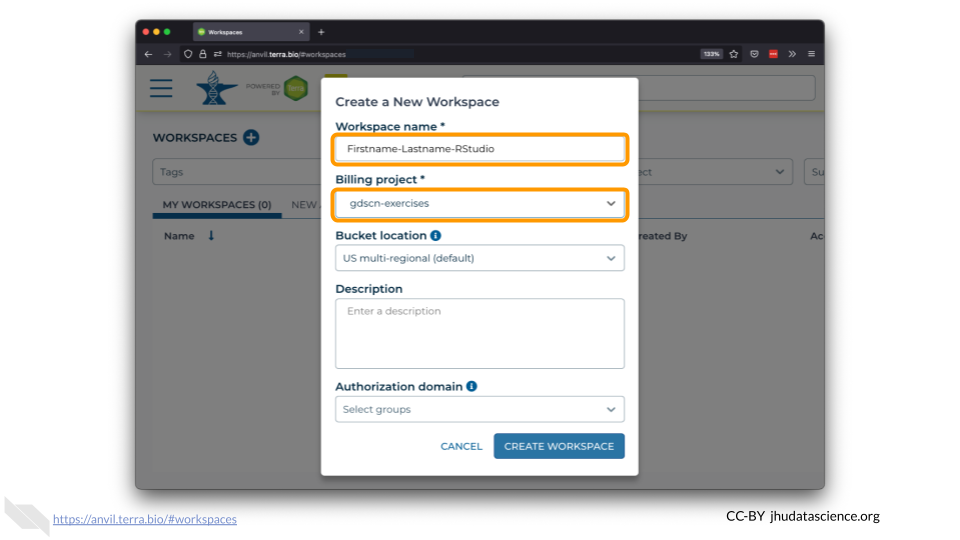
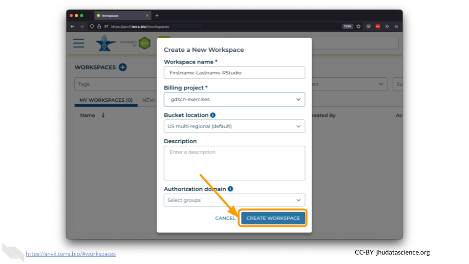

# Creating a Workspace {#workspace}

Now that you have an account that works with AnVIL, you are ready to get started! In this chapter, we will learn about **Workspaces**, the fundamental work units inside AnVIL. Once you have created a Workspace, you can launch many tools and explore datasets. We will use a Workspace to launch [RStudio](#rstudio) in the next chapter.

On AnVIL, you use Workspaces to configure and run analyses and share results. Workspaces support interactive analysis with RStudio, Jupyter notebooks, Bioconductor and Galaxy. Workspaces can also save the output generated by running an analysis with a Workspace’s associated “cloud environment.” Check out [https://anvilproject.org](https://anvilproject.org) to learn more about everything you can do within a Workspace.

1. [Launch Terra on AnVIL](https://anvil.terra.bio/#workspaces)

1. In the drop-down menu on the left, navigate to "Workspaces". Click the triple bar in the top left corner to access the menu. Click "Workspaces".

    

1. Click on the **plus icon** near the top of left of the page.

    

1. Name your Workspace and select the Billing Project as indicated by your instructor.

    

1. Do not change the Bucket Location or Authorization Domain. You can add a Description if you wish.

1. Click "CREATE WORKSPACE". The new Workspace should now show up under your Workspaces.

    
