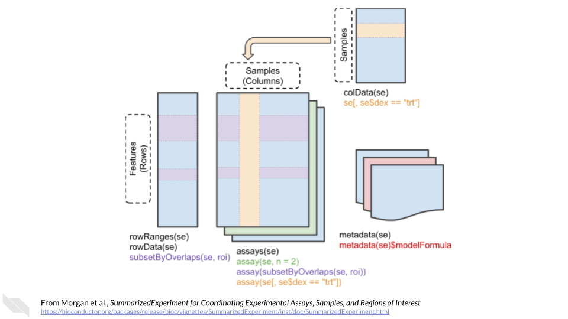

# (PART\*) EXPRESSION DATA {-}

# The `SummarizedExperiment` class {#summarizedexperiment}

## Overview

One of the main strengths of using Bioconductor for bioinformatics is their data infrastructure. These data classes are built with genomics data in mind. This makes data compatible with different packages and/or methods. It also makes data easier to manipulate.

The `SummarizedExperiment` class is used to store rectangular matrices of experimental results, which are commonly produced by sequencing and microarray experiments. Each `SummarizedExperiment` stores observations of one or more samples, along with additional meta-data describing both the observations (features) and samples (phenotypes).

A key aspect of the `SummarizedExperiment` class is the coordination of the meta-data and assays when subsetting. For example, if you want to exclude a given sample you can do for both the meta-data and assay in one operation, which ensures the meta-data and observed data will remain in sync. Improperly accounting for meta and observational data has resulted in a number of incorrect results and retractions so this is a very desirable property.

`SummarizedExperiment` is a matrix-like container where rows represent features of interest (e.g. genes, transcripts, exons, etc.) and columns represent samples. The objects contain one or more assays, each represented by a matrix-like object of numeric or other mode. The rows of a `SummarizedExperiment` object represent features of interest. Information about these features is stored in a DataFrame object, accessible using the function rowData(). Each row of the DataFrame provides information on the feature in the corresponding row of the `SummarizedExperiment` object. Columns of the DataFrame represent different attributes of the features of interest, e.g., gene or transcript IDs, etc.

    

The above information comes directly from the [vignette](https://bioconductor.org/packages/release/bioc/vignettes/SummarizedExperiment/inst/doc/SummarizedExperiment.html) for `SummarizedExperiment`. Please check out their page for more information.

## Exploring `SummarizedExperiment`

First, we will load the necessary packages.


```r
# Install and load airway
# AnVIL::install(c("airway"))
library(airway)
```

Load the gene expression data. The "airway" data is from an RNA-Seq experiment on four human airway smooth muscle cell lines treated with dexamethasone. You can learn more about the experiment in @Himes2014.


```r
# Load the gene expression data
data(airway)
```

`assay()` provides a matrix-like or list of matrix-like objects of identical dimension.

- rows: genes, genomic coordinates, etc.
- columns: samples, cells, etc.
    

```r
assay_data <- assay(airway)
head(assay_data)
```

```
##                 SRR1039508 SRR1039509 SRR1039512 SRR1039513 SRR1039516
## ENSG00000000003        679        448        873        408       1138
## ENSG00000000005          0          0          0          0          0
## ENSG00000000419        467        515        621        365        587
## ENSG00000000457        260        211        263        164        245
## ENSG00000000460         60         55         40         35         78
## ENSG00000000938          0          0          2          0          1
##                 SRR1039517 SRR1039520 SRR1039521
## ENSG00000000003       1047        770        572
## ENSG00000000005          0          0          0
## ENSG00000000419        799        417        508
## ENSG00000000457        331        233        229
## ENSG00000000460         63         76         60
## ENSG00000000938          0          0          0
```
    
`colData()` provides annotations on each column, as a DataFrame. In other words, it provides descriptions of each sample.
    

```r
colData(airway)
```

```
## DataFrame with 8 rows and 9 columns
##            SampleName     cell      dex    albut        Run avgLength
##              <factor> <factor> <factor> <factor>   <factor> <integer>
## SRR1039508 GSM1275862  N61311     untrt    untrt SRR1039508       126
## SRR1039509 GSM1275863  N61311     trt      untrt SRR1039509       126
## SRR1039512 GSM1275866  N052611    untrt    untrt SRR1039512       126
## SRR1039513 GSM1275867  N052611    trt      untrt SRR1039513        87
## SRR1039516 GSM1275870  N080611    untrt    untrt SRR1039516       120
## SRR1039517 GSM1275871  N080611    trt      untrt SRR1039517       126
## SRR1039520 GSM1275874  N061011    untrt    untrt SRR1039520       101
## SRR1039521 GSM1275875  N061011    trt      untrt SRR1039521        98
##            Experiment    Sample    BioSample
##              <factor>  <factor>     <factor>
## SRR1039508  SRX384345 SRS508568 SAMN02422669
## SRR1039509  SRX384346 SRS508567 SAMN02422675
## SRR1039512  SRX384349 SRS508571 SAMN02422678
## SRR1039513  SRX384350 SRS508572 SAMN02422670
## SRR1039516  SRX384353 SRS508575 SAMN02422682
## SRR1039517  SRX384354 SRS508576 SAMN02422673
## SRR1039520  SRX384357 SRS508579 SAMN02422683
## SRR1039521  SRX384358 SRS508580 SAMN02422677
```
    
`rowData()` and / or `rowRanges()` provide annotations on each row.

- `rowRanges()`: coordinates of gene / exons in transcripts / etc.
- `rowData()`: P-values and log-fold change of each gene after differential expression analysis.


```r
rowRanges(airway)
```

```
## GRangesList object of length 64102:
## $ENSG00000000003
## GRanges object with 17 ranges and 2 metadata columns:
##        seqnames            ranges strand |   exon_id       exon_name
##           <Rle>         <IRanges>  <Rle> | <integer>     <character>
##    [1]        X 99883667-99884983      - |    667145 ENSE00001459322
##    [2]        X 99885756-99885863      - |    667146 ENSE00000868868
##    [3]        X 99887482-99887565      - |    667147 ENSE00000401072
##    [4]        X 99887538-99887565      - |    667148 ENSE00001849132
##    [5]        X 99888402-99888536      - |    667149 ENSE00003554016
##    ...      ...               ...    ... .       ...             ...
##   [13]        X 99890555-99890743      - |    667156 ENSE00003512331
##   [14]        X 99891188-99891686      - |    667158 ENSE00001886883
##   [15]        X 99891605-99891803      - |    667159 ENSE00001855382
##   [16]        X 99891790-99892101      - |    667160 ENSE00001863395
##   [17]        X 99894942-99894988      - |    667161 ENSE00001828996
##   -------
##   seqinfo: 722 sequences (1 circular) from an unspecified genome
## 
## ...
## <64101 more elements>
```

metadata(): List of unstructured metadata describing the overall content of the object.


```r
metadata(airway)
```

```
## [[1]]
## Experiment data
##   Experimenter name: Himes BE 
##   Laboratory: NA 
##   Contact information:  
##   Title: RNA-Seq transcriptome profiling identifies CRISPLD2 as a glucocorticoid responsive gene that modulates cytokine function in airway smooth muscle cells. 
##   URL: http://www.ncbi.nlm.nih.gov/pubmed/24926665 
##   PMIDs: 24926665 
## 
##   Abstract: A 226 word abstract is available. Use 'abstract' method.
```

Please see [this vignette](https://bioconductor.org/help/course-materials/2019/BSS2019/04_Practical_CoreApproachesInBioconductor.html) for more information.

## Subsetting `SummarizedExperiment`

Often, you'll find you want to subset your expression/count data. You can do this by selecting the samples (columns) or features/genes (rows) you want to keep.


```r
# Collect the counts and sample data
raw_counts <- assay(airway)
sample_data <- colData(airway)

# Select samples 1 and 2
samples_1_2 <- raw_counts[, 1:2]
head(samples_1_2)
```

```
##                 SRR1039508 SRR1039509
## ENSG00000000003        679        448
## ENSG00000000005          0          0
## ENSG00000000419        467        515
## ENSG00000000457        260        211
## ENSG00000000460         60         55
## ENSG00000000938          0          0
```

```r
# Select untreated samples
untrt_samples <- raw_counts[, sample_data$dex == "untrt"]
head(untrt_samples)
```

```
##                 SRR1039508 SRR1039512 SRR1039516 SRR1039520
## ENSG00000000003        679        873       1138        770
## ENSG00000000005          0          0          0          0
## ENSG00000000419        467        621        587        417
## ENSG00000000457        260        263        245        233
## ENSG00000000460         60         40         78         76
## ENSG00000000938          0          2          1          0
```

```r
# Select features where mean expression > 0 across samples
nonzero_features <- raw_counts[rowMeans(raw_counts) > 0, ]
head(nonzero_features)
```

```
##                 SRR1039508 SRR1039509 SRR1039512 SRR1039513 SRR1039516
## ENSG00000000003        679        448        873        408       1138
## ENSG00000000419        467        515        621        365        587
## ENSG00000000457        260        211        263        164        245
## ENSG00000000460         60         55         40         35         78
## ENSG00000000938          0          0          2          0          1
## ENSG00000000971       3251       3679       6177       4252       6721
##                 SRR1039517 SRR1039520 SRR1039521
## ENSG00000000003       1047        770        572
## ENSG00000000419        799        417        508
## ENSG00000000457        331        233        229
## ENSG00000000460         63         76         60
## ENSG00000000938          0          0          0
## ENSG00000000971      11027       5176       7995
```

## Recap


```r
# Learn more about the class
?SummarizedExperiment::`SummarizedExperiment-class`
# Browse vignettes and more
??SummarizedExperiment
```


```r
sessionInfo()
```

```
## R version 4.0.2 (2020-06-22)
## Platform: x86_64-pc-linux-gnu (64-bit)
## Running under: Ubuntu 20.04.3 LTS
## 
## Matrix products: default
## BLAS/LAPACK: /usr/lib/x86_64-linux-gnu/openblas-pthread/libopenblasp-r0.3.8.so
## 
## locale:
##  [1] LC_CTYPE=en_US.UTF-8       LC_NUMERIC=C              
##  [3] LC_TIME=en_US.UTF-8        LC_COLLATE=en_US.UTF-8    
##  [5] LC_MONETARY=en_US.UTF-8    LC_MESSAGES=C             
##  [7] LC_PAPER=en_US.UTF-8       LC_NAME=C                 
##  [9] LC_ADDRESS=C               LC_TELEPHONE=C            
## [11] LC_MEASUREMENT=en_US.UTF-8 LC_IDENTIFICATION=C       
## 
## attached base packages:
## [1] parallel  stats4    stats     graphics  grDevices utils     datasets 
## [8] methods   base     
## 
## other attached packages:
##  [1] airway_1.10.0               SummarizedExperiment_1.20.0
##  [3] Biobase_2.50.0              GenomicRanges_1.42.0       
##  [5] GenomeInfoDb_1.26.7         IRanges_2.24.1             
##  [7] S4Vectors_0.28.1            BiocGenerics_0.36.1        
##  [9] MatrixGenerics_1.2.1        matrixStats_0.61.0         
## 
## loaded via a namespace (and not attached):
##  [1] XVector_0.30.0         pillar_1.4.6           compiler_4.0.2        
##  [4] BiocManager_1.30.10    jquerylib_0.1.4        highr_0.8             
##  [7] zlibbioc_1.36.0        bitops_1.0-7           tools_4.0.2           
## [10] digest_0.6.25          lattice_0.20-41        evaluate_0.14         
## [13] lifecycle_1.0.0        tibble_3.0.3           pkgconfig_2.0.3       
## [16] png_0.1-7              rlang_0.4.10           Matrix_1.2-18         
## [19] DelayedArray_0.16.3    curl_4.3               yaml_2.2.1            
## [22] xfun_0.26              GenomeInfoDbData_1.2.4 httr_1.4.2            
## [25] stringr_1.4.0          knitr_1.33             fs_1.5.0              
## [28] vctrs_0.3.4            hms_0.5.3              grid_4.0.2            
## [31] R6_2.4.1               ottrpal_0.1.2          rmarkdown_2.10        
## [34] bookdown_0.24          readr_1.4.0            magrittr_2.0.2        
## [37] ellipsis_0.3.1         htmltools_0.5.0        stringi_1.5.3         
## [40] RCurl_1.98-1.2         crayon_1.3.4
```
