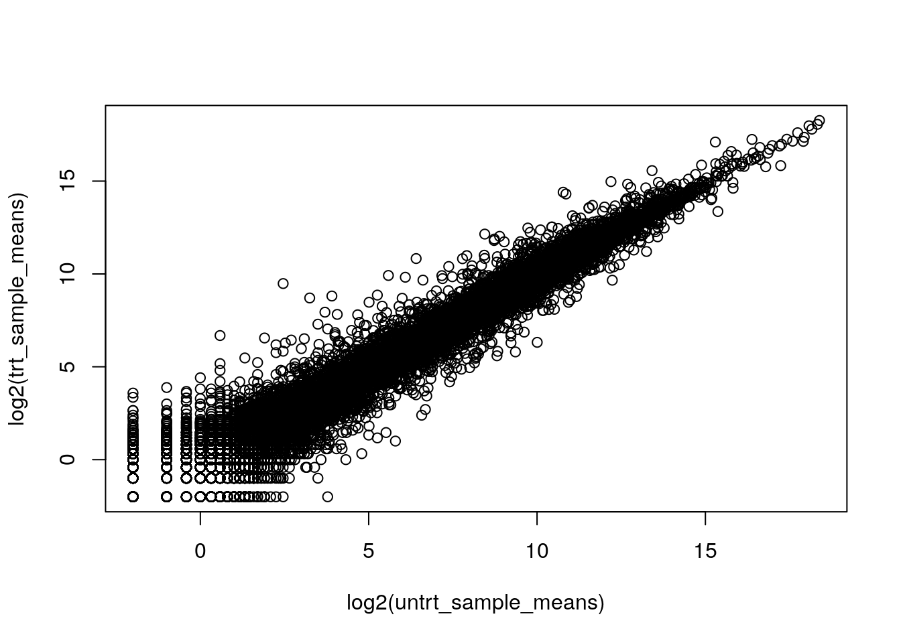
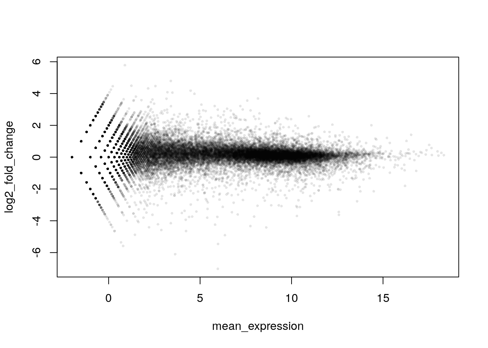

# Transformation, Fold-change, & MA Plots

The following excerpt comes from @Ritchie2015 :

> _Measuring expression in multiple RNA samples produces columns of correlated expression values, which are highly correlated because they are measured on the same set of genes or genomic features. It has long been established in the biomedical literature that the level of agreement between correlated variables can be usefully examined by plotting differences versus means._

In other words, gene expression data is full of correlations. We must think carefully about how we examine and plot gene expression data. In the next steps, we will:

- Examine how $\log_{2}$ transformations and fold-change improve data clarity
- Learn how to make MA plots on gene expression data

Much of the following has been adopted from the [`Glimma` vignette](https://bioconductor.org/packages/release/bioc/vignettes/Glimma/inst/doc/limma_edger.html) for `limma` and `edgeR` [@Su2017].

## Gene Expression Data

First, we will load the necessary packages.


```r
# Install and load airway
# AnVIL::install(c("airway"))
library(airway)
```

Load the gene expression data. We will be using data from an RNA-Seq experiment on four human airway smooth muscle cell lines treated with dexamethasone [@Himes2014].


```r
# Load the gene expression data
data(airway)
head(assay(airway),10)
```

```
##                 SRR1039508 SRR1039509 SRR1039512 SRR1039513 SRR1039516
## ENSG00000000003        679        448        873        408       1138
## ENSG00000000005          0          0          0          0          0
## ENSG00000000419        467        515        621        365        587
## ENSG00000000457        260        211        263        164        245
## ENSG00000000460         60         55         40         35         78
## ENSG00000000938          0          0          2          0          1
## ENSG00000000971       3251       3679       6177       4252       6721
## ENSG00000001036       1433       1062       1733        881       1424
## ENSG00000001084        519        380        595        493        820
## ENSG00000001167        394        236        464        175        658
##                 SRR1039517 SRR1039520 SRR1039521
## ENSG00000000003       1047        770        572
## ENSG00000000005          0          0          0
## ENSG00000000419        799        417        508
## ENSG00000000457        331        233        229
## ENSG00000000460         63         76         60
## ENSG00000000938          0          0          0
## ENSG00000000971      11027       5176       7995
## ENSG00000001036       1439       1359       1109
## ENSG00000001084        714        696        704
## ENSG00000001167        584        360        269
```

In this data, each sample is in a column, while each gene is in a row. These raw counts range from very small to quite large numbers!

## Plotting Raw Counts

Let's say we want to compare treated and untreated samples. We will first look at the sample data.


```r
# View metadata
colData(airway)
```

```
## DataFrame with 8 rows and 9 columns
##            SampleName     cell      dex    albut        Run avgLength
##              <factor> <factor> <factor> <factor>   <factor> <integer>
## SRR1039508 GSM1275862  N61311     untrt    untrt SRR1039508       126
## SRR1039509 GSM1275863  N61311     trt      untrt SRR1039509       126
## SRR1039512 GSM1275866  N052611    untrt    untrt SRR1039512       126
## SRR1039513 GSM1275867  N052611    trt      untrt SRR1039513        87
## SRR1039516 GSM1275870  N080611    untrt    untrt SRR1039516       120
## SRR1039517 GSM1275871  N080611    trt      untrt SRR1039517       126
## SRR1039520 GSM1275874  N061011    untrt    untrt SRR1039520       101
## SRR1039521 GSM1275875  N061011    trt      untrt SRR1039521        98
##            Experiment    Sample    BioSample
##              <factor>  <factor>     <factor>
## SRR1039508  SRX384345 SRS508568 SAMN02422669
## SRR1039509  SRX384346 SRS508567 SAMN02422675
## SRR1039512  SRX384349 SRS508571 SAMN02422678
## SRR1039513  SRX384350 SRS508572 SAMN02422670
## SRR1039516  SRX384353 SRS508575 SAMN02422682
## SRR1039517  SRX384354 SRS508576 SAMN02422673
## SRR1039520  SRX384357 SRS508579 SAMN02422683
## SRR1039521  SRX384358 SRS508580 SAMN02422677
```

We will manually take the mean across treated and untreated samples.


```r
# Collect the counts and sample data
raw_counts <- assay(airway)
sample_data <- colData(airway)

# Select untreated samples
untrt_sample_means <- rowMeans2(raw_counts[, sample_data$dex == "untrt"])

# Select treated samples
trt_sample_means <- rowMeans2(raw_counts[, sample_data$dex == "trt"])
```

Then we will plot the two groups.


```r
plot(untrt_sample_means, trt_sample_means)
```


This is hard to interpret. Most of the genes are clustered in the bottom left corner.

## Transforming ($\log_{2}$)

Using a $\log_{2}$ transformation makes it easier to examine all the genes together.


```r
# Plot with log2 transformation
plot(log2(untrt_sample_means), log2(trt_sample_means))
```



## Using Fold-Change to Create an MA Plot

As stated at the very start of this chapter, plotting differences versus means can be very helpful when many genes are correlated. It also makes interpretation easier when combined with a $\log_{2}$ transformation.

In the next steps, you will create a preliminary MA plot. MA plots are a widely used way to visualize genomic data. The _**M**_ represents the difference between two conditions (fold-change), while the _**A**_ represents the average intensity of the expression. Both values take on a $\log_{2}$ transformation.

_**M**_ is expressed as a log ratio or difference in the following form. _**M**_ is almost always placed on the y-axis.

$$M = log_{2}(\frac{condition 1}{condition 2}) = log_{2}(condition 1) - log_{2}(condition2)$$

_**A**_ is more simple, taking the form of a transformed average. _**A**_ is often called "log mean expression" and is almost always placed on the x-axis.

$$A = \frac{1}{2} (log_{2}(condition 1) + log_{2}(condition 2))$$

When untreated and treated expression are equal, fold-change is equal to zero.


```r
log2(10) - log2(10)
```

```
## [1] 0
```

When untreated expression is greater, fold-change is positive.


```r
log2(20) - log2(10)
```

```
## [1] 1
```

```r
log2(100) - log2(1)
```

```
## [1] 6.643856
```

However when treated expression is greater, fold-change is negative.


```r
log2(10) - log2(20)
```

```
## [1] -1
```

```r
log2(1) - log2(100)
```

```
## [1] -6.643856
```

Calculate log2 fold-change and mean expression for the data.


```r
log2_fold_change <- log2(untrt_sample_means) - log2(trt_sample_means)
mean_expression <- (log2(untrt_sample_means) + log2(trt_sample_means)) / 2
```

Plot the values above, with mean expression on the x-axis and fold-change on the y-axis.


```r
plot(mean_expression, log2_fold_change)
```


Since there are many data points, it's a good idea to customize your plot. The `ggplot2` package can also provide greater flexibility with plotting.


```r
library(scales)
```

```
## Warning: package 'scales' was built under R version 4.0.3
```

```r
plot(mean_expression, log2_fold_change, col = alpha("black", 0.1), pch = 16, cex = 0.5)
```



This gives us a very rough idea of how transformation and using fold-change can aid in interpretation of the data. In reality, we need to cover a few more steps before creating this kind of plot.

## Future Directions

A simple MA plot can be produced with the `plotMA()` function from the `limma` package. Other packages for exploring differential gene expression in R, such as `DESeq2`, also have functions to create MA plots.


```r
# Not run
plotMA()
```

`glimmaMA()` from the `Glimma` package creates interactive MA plots.


```r
# Not run
glimmaMA()
```

## Recap


```r
sessionInfo()
```

```
## R version 4.0.2 (2020-06-22)
## Platform: x86_64-pc-linux-gnu (64-bit)
## Running under: Ubuntu 20.04.3 LTS
## 
## Matrix products: default
## BLAS/LAPACK: /usr/lib/x86_64-linux-gnu/openblas-pthread/libopenblasp-r0.3.8.so
## 
## locale:
##  [1] LC_CTYPE=en_US.UTF-8       LC_NUMERIC=C              
##  [3] LC_TIME=en_US.UTF-8        LC_COLLATE=en_US.UTF-8    
##  [5] LC_MONETARY=en_US.UTF-8    LC_MESSAGES=C             
##  [7] LC_PAPER=en_US.UTF-8       LC_NAME=C                 
##  [9] LC_ADDRESS=C               LC_TELEPHONE=C            
## [11] LC_MEASUREMENT=en_US.UTF-8 LC_IDENTIFICATION=C       
## 
## attached base packages:
## [1] parallel  stats4    stats     graphics  grDevices utils     datasets 
## [8] methods   base     
## 
## other attached packages:
##  [1] scales_1.1.1                airway_1.10.0              
##  [3] SummarizedExperiment_1.20.0 Biobase_2.50.0             
##  [5] GenomicRanges_1.42.0        GenomeInfoDb_1.26.7        
##  [7] IRanges_2.24.1              S4Vectors_0.28.1           
##  [9] BiocGenerics_0.36.1         MatrixGenerics_1.2.1       
## [11] matrixStats_0.61.0         
## 
## loaded via a namespace (and not attached):
##  [1] compiler_4.0.2         BiocManager_1.30.10    jquerylib_0.1.4       
##  [4] highr_0.8              XVector_0.30.0         bitops_1.0-7          
##  [7] tools_4.0.2            zlibbioc_1.36.0        digest_0.6.25         
## [10] evaluate_0.14          lifecycle_1.0.0        lattice_0.20-41       
## [13] rlang_0.4.10           Matrix_1.2-18          DelayedArray_0.16.3   
## [16] yaml_2.2.1             xfun_0.26              GenomeInfoDbData_1.2.4
## [19] stringr_1.4.0          knitr_1.33             grid_4.0.2            
## [22] R6_2.4.1               rmarkdown_2.10         bookdown_0.24         
## [25] farver_2.0.3           magrittr_2.0.2         htmltools_0.5.0       
## [28] colorspace_1.4-1       stringi_1.5.3          munsell_0.5.0         
## [31] RCurl_1.98-1.2
```
