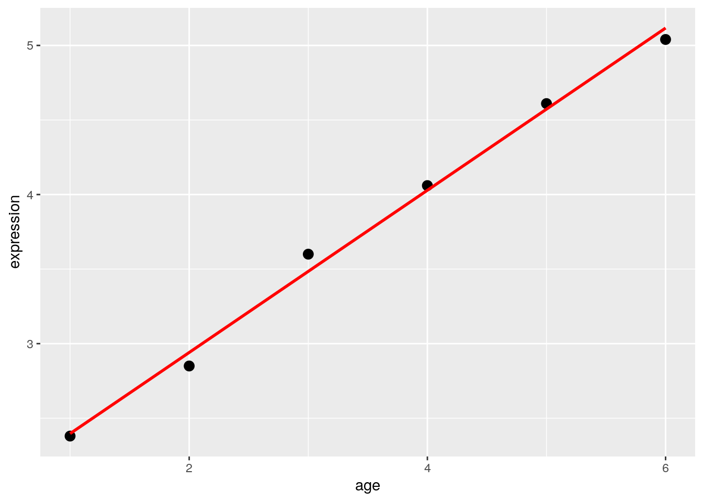
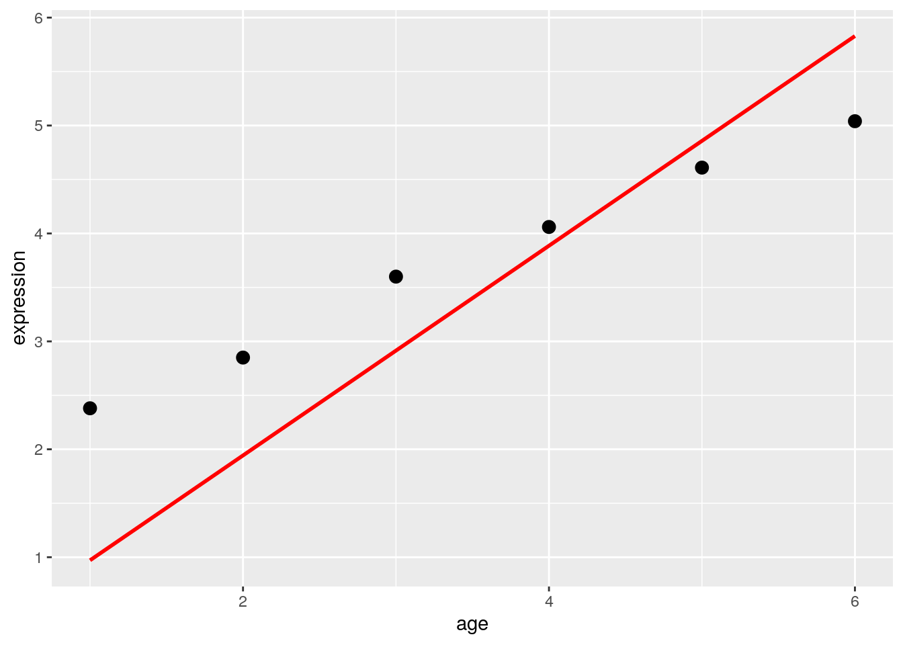
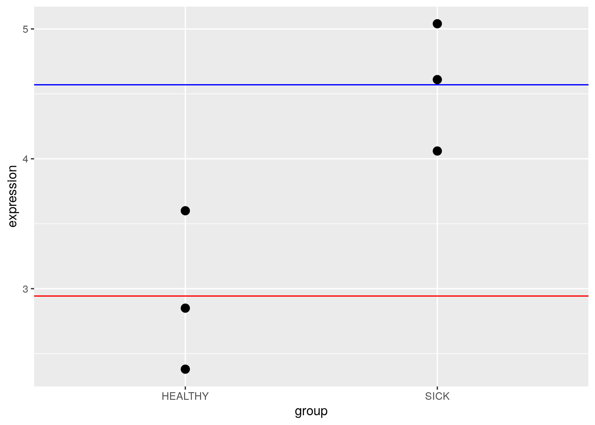
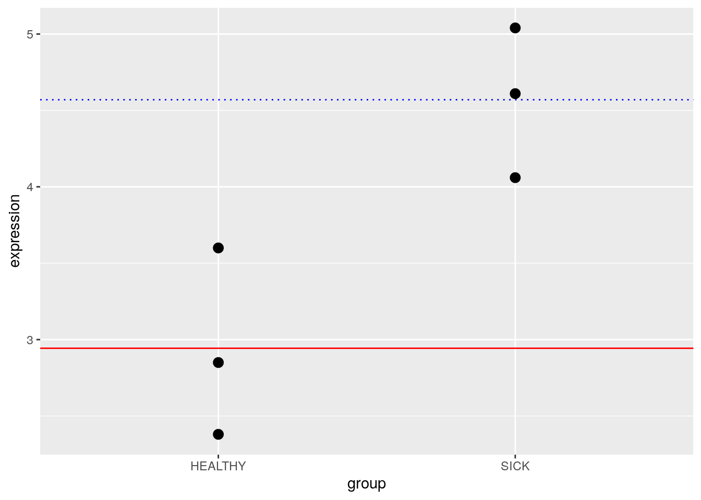

# Design Matrices

## Overview

When performing differential expression analysis on genomic data (such as RNA-seq experiments), scientists usually use linear models to determine the direction (did expression go up or down?) and magnitude (by how much?) of the change in expression. These scientists are interested in understanding the relationship between gene expression (the "response" variable") and variables that affect expression, such as a treatment or cell type ("explanatory variable(s)").

Design matrices are fundamental concepts in mathematics, statistics, and other domains, but their application to genomic data can introduce some complexity.

See this Bioconductor [vignette](https://bioconductor.org/packages/release/workflows/vignettes/RNAseq123/inst/doc/designmatrices.html#introduction) for an excellent, in-depth look at design matrices.

## Types of Models

The type of explanatory variables in our experiment will determine what our model looks like. 

### Regression: Continuous Variables

Continuous variables, or covariates, are numeric. This means that we could create a scatterplot comparing the covariate and expression. We could then imagine drawing a best fit line through those points to create our model. @Law2020 state:

> [Covariates] can be the age or weight of an individual, or other molecular or cellular phenotypes on a sample... For covariates, it is generally of interest to know the rate of change between the response and the covariate, such as “how much does the expression of a particular gene increase/decrease per unit increase in age?”. We can use a straight line to model, or describe, this relationship, which takes the form of 
> 
> $$Expression = \beta_{0} + \beta_{1}age$$
>
> where the line is defined by $\beta_{0}$ the y-intercept and $\beta_{1}$ the slope. In this model, the age covariate takes continuous, numerical values such as 0.8, 1.3, 2.0, 5.6, and so on.

These $\beta$ values are known as _parameters_ and are important for determining the impact of explanatory variables on expression.


### Means: Categorical Variables

Categorical variables are discrete variables, or factors. We can think of these variables as "bins" that our samples fall into. @Law2020 state:

> [Factors] are often separated into those that are of a biological nature (e.g. disease status, genotype, treatment, cell-type) and those that are of a technical nature (e.g. experiment time, sample batch, handling technician, sequencing lane). Unique values within a factor are referred to as levels. For example, genotype as a factor may contain two levels, “wildtype” and “mutant”. Here, it is generally of interest to determine the expected or mean gene expression for each state or level of the factor. The relationship between gene expression and the factor can be described, or modeled, in the form of 
>
> $$Expression = \beta_{1}wildtype + \beta_{2}mutant$$
>
> where $\beta_{1}$ represents the mean gene expression for wildtype, and $\beta_{2}$ represents the mean gene expression for mutant.

The "genotype" factor in this model is not numeric like "age" above, so the calculations work a bit differently. For any given sample, it can be either wildtype or mutant but not both. So, the values "wildtype" and "mutant" can only be zero (no) or one (yes). When a sample is mutant, "wildtype" = 0, and $\beta_{1}$ drops out of the equation. Likewise, when a sample is wildtype, "mutant" = 0, and $\beta_{2}$ drops out of the equation. This kind of model is called a **means model**.


### Mean-Reference: Categorical Variables

You can also design categorical models with a "reference" value for comparison. @Law2020 state:

> An alternative parameterisation of the means model directly calculates the gene expression difference between mutant and wildtype. It does so by using one of the levels as a reference. Such a model is parameterised for the mean expression of the reference level (e.g. wildtype), and the rest of the levels are parameterised relative to the reference (e.g. the difference between mutant and wildtype). The relationship between gene expression and genotype is modeled in the form of 
>
> $$Expression = \beta_{1} + \beta_{2}mutant$$
>
> where $\beta_{1}$ represents the mean gene expression for wildtype, and $\beta_{2}$ is the difference between means of mutant and wildtype

This kind of model can be really useful if you are interested in the _**difference**_ between groups rather than the estimated parameters for the groups themselves. This kind of model is called a **mean-reference model**.


## Making a Design Matrix

@Law2020 use the following data to demonstrate how you might build a design matrix. This is a very simple example - in reality, we'd have many more genes being expressed.


```r
df
```

```
##   expression  mouse age   group
## 1       2.38 MOUSE1   1 HEALTHY
## 2       2.85 MOUSE2   2 HEALTHY
## 3       3.60 MOUSE3   3 HEALTHY
## 4       4.06 MOUSE4   4    SICK
## 5       4.61 MOUSE5   5    SICK
## 6       5.04 MOUSE6   6    SICK
```

### Regression: Continuous Variables

Use the `model.matrix()` function to create the design matrix with the continuous variable "age".


```r
model.matrix( ~ df$age)
```

```
##   (Intercept) df$age
## 1           1      1
## 2           1      2
## 3           1      3
## 4           1      4
## 5           1      5
## 6           1      6
## attr(,"assign")
## [1] 0 1
```



You can remove the intercept by adding zero to the design matrix. This forces the y-intercept to be zero. You could also use a different number here.


```r
model.matrix( ~ 0 + df$age)
```

```
##   df$age
## 1      1
## 2      2
## 3      3
## 4      4
## 5      5
## 6      6
## attr(,"assign")
## [1] 1
```



### Means: Categorical Variables {#means}

Use the `model.matrix()` function to create the design matrix with the factor "group". To create a **means model**, you should include a zero in the model.


```r
model.matrix( ~ 0 + df$group)
```

```
##   df$groupHEALTHY df$groupSICK
## 1               1            0
## 2               1            0
## 3               1            0
## 4               0            1
## 5               0            1
## 6               0            1
## attr(,"assign")
## [1] 1 1
## attr(,"contrasts")
## attr(,"contrasts")$`df$group`
## [1] "contr.treatment"
```



Notice that you only see zeros and ones for the two groups: `df$groupHEALTHY` and `df$groupSICK`.

### Mean-Reference: Categorical Variables {#meanref}

Simply remove the zero to use a **mean-reference model**.


```r
model.matrix( ~ df$group)
```

```
##   (Intercept) df$groupSICK
## 1           1            0
## 2           1            0
## 3           1            0
## 4           1            1
## 5           1            1
## 6           1            1
## attr(,"assign")
## [1] 0 1
## attr(,"contrasts")
## attr(,"contrasts")$`df$group`
## [1] "contr.treatment"
```



Notice how there is now an intercept. Remember that the parameter will now represent the _**difference**_ between the groups instead of the second group mean.

## More Complex Designs

`model.matrix()` can easily handle more complex experimental designs.


```r
df2
```

```
##    expression   mouse   group     type
## 1        2.38  MOUSE1 HEALTHY WILDTYPE
## 2        2.85  MOUSE2 HEALTHY WILDTYPE
## 3        3.60  MOUSE3 HEALTHY WILDTYPE
## 4        4.06  MOUSE4    SICK WILDTYPE
## 5        4.61  MOUSE5    SICK WILDTYPE
## 6        5.04  MOUSE6    SICK WILDTYPE
## 7        6.48  MOUSE7 HEALTHY   MUTANT
## 8        6.70  MOUSE8 HEALTHY   MUTANT
## 9        8.01  MOUSE9 HEALTHY   MUTANT
## 10      11.99 MOUSE10    SICK   MUTANT
## 11      12.81 MOUSE11    SICK   MUTANT
## 12      14.73 MOUSE12    SICK   MUTANT
```

The following will create a design matrix for "group" and "type".


```r
model.matrix( ~ df2$group + df2$type)
```

```
##    (Intercept) df2$groupSICK df2$typeWILDTYPE
## 1            1             0                1
## 2            1             0                1
## 3            1             0                1
## 4            1             1                1
## 5            1             1                1
## 6            1             1                1
## 7            1             0                0
## 8            1             0                0
## 9            1             0                0
## 10           1             1                0
## 11           1             1                0
## 12           1             1                0
## attr(,"assign")
## [1] 0 1 2
## attr(,"contrasts")
## attr(,"contrasts")$`df2$group`
## [1] "contr.treatment"
## 
## attr(,"contrasts")$`df2$type`
## [1] "contr.treatment"
```

Use the "*" to create a design matrix for the "group" and "type" as well as their interaction.


```r
model.matrix( ~ df2$group + df2$type)
```

```
##    (Intercept) df2$groupSICK df2$typeWILDTYPE
## 1            1             0                1
## 2            1             0                1
## 3            1             0                1
## 4            1             1                1
## 5            1             1                1
## 6            1             1                1
## 7            1             0                0
## 8            1             0                0
## 9            1             0                0
## 10           1             1                0
## 11           1             1                0
## 12           1             1                0
## attr(,"assign")
## [1] 0 1 2
## attr(,"contrasts")
## attr(,"contrasts")$`df2$group`
## [1] "contr.treatment"
## 
## attr(,"contrasts")$`df2$type`
## [1] "contr.treatment"
```

## Design Matrix in Practice {#inpractice}

Let's practice on a genomics dataset. Load the `airway` dataset. You might need to install it. Recall that the "airway" data is from an RNA-Seq experiment on four human airway smooth muscle cell lines treated with dexamethasone. You can learn more about the experiment in @Himes2014. 


```r
# AnVIL::install("airway")
library(airway)
data(airway)
```

In the [`SummarizedExperiment` chapter](summarizedexperiment.html#summarizedexperiment), we learned that `colData()` provides descriptions of each sample.


```r
colData(airway)
```

```
## DataFrame with 8 rows and 9 columns
##            SampleName     cell      dex    albut        Run avgLength
##              <factor> <factor> <factor> <factor>   <factor> <integer>
## SRR1039508 GSM1275862  N61311     untrt    untrt SRR1039508       126
## SRR1039509 GSM1275863  N61311     trt      untrt SRR1039509       126
## SRR1039512 GSM1275866  N052611    untrt    untrt SRR1039512       126
## SRR1039513 GSM1275867  N052611    trt      untrt SRR1039513        87
## SRR1039516 GSM1275870  N080611    untrt    untrt SRR1039516       120
## SRR1039517 GSM1275871  N080611    trt      untrt SRR1039517       126
## SRR1039520 GSM1275874  N061011    untrt    untrt SRR1039520       101
## SRR1039521 GSM1275875  N061011    trt      untrt SRR1039521        98
##            Experiment    Sample    BioSample
##              <factor>  <factor>     <factor>
## SRR1039508  SRX384345 SRS508568 SAMN02422669
## SRR1039509  SRX384346 SRS508567 SAMN02422675
## SRR1039512  SRX384349 SRS508571 SAMN02422678
## SRR1039513  SRX384350 SRS508572 SAMN02422670
## SRR1039516  SRX384353 SRS508575 SAMN02422682
## SRR1039517  SRX384354 SRS508576 SAMN02422673
## SRR1039520  SRX384357 SRS508579 SAMN02422683
## SRR1039521  SRX384358 SRS508580 SAMN02422677
```

Notice above how the `dex` column indicates a `trt` or `untrt` condition. The following code will create a design matrix based on `dex` treatment. Since this is a categorical variable, we need to use a [means](#means) or [mean-reference](#meanref) model.

First, create a means model using the following code.


```r
sample_data <- colData(airway)
model.matrix( ~ 0 + sample_data$dex)
```

```
##   sample_data$dextrt sample_data$dexuntrt
## 1                  0                    1
## 2                  1                    0
## 3                  0                    1
## 4                  1                    0
## 5                  0                    1
## 6                  1                    0
## 7                  0                    1
## 8                  1                    0
## attr(,"assign")
## [1] 1 1
## attr(,"contrasts")
## attr(,"contrasts")$`sample_data$dex`
## [1] "contr.treatment"
```

Now try creating a mean-reference model using the following.


```r
model.matrix( ~ sample_data$dex)
```

```
##   (Intercept) sample_data$dexuntrt
## 1           1                    1
## 2           1                    0
## 3           1                    1
## 4           1                    0
## 5           1                    1
## 6           1                    0
## 7           1                    1
## 8           1                    0
## attr(,"assign")
## [1] 0 1
## attr(,"contrasts")
## attr(,"contrasts")$`sample_data$dex`
## [1] "contr.treatment"
```

::: {.reflection}
QUESTIONS:

1. What is the difference between the two design matrices you created above?
2. Does it matter which one you use? Why or why not?
:::

## Recap


```r
sessionInfo()
```

```
## R version 4.1.3 (2022-03-10)
## Platform: x86_64-pc-linux-gnu (64-bit)
## Running under: Ubuntu 20.04.5 LTS
## 
## Matrix products: default
## BLAS:   /usr/lib/x86_64-linux-gnu/openblas-pthread/libblas.so.3
## LAPACK: /usr/lib/x86_64-linux-gnu/openblas-pthread/liblapack.so.3
## 
## locale:
##  [1] LC_CTYPE=en_US.UTF-8       LC_NUMERIC=C              
##  [3] LC_TIME=en_US.UTF-8        LC_COLLATE=en_US.UTF-8    
##  [5] LC_MONETARY=en_US.UTF-8    LC_MESSAGES=en_US.UTF-8   
##  [7] LC_PAPER=en_US.UTF-8       LC_NAME=C                 
##  [9] LC_ADDRESS=C               LC_TELEPHONE=C            
## [11] LC_MEASUREMENT=en_US.UTF-8 LC_IDENTIFICATION=C       
## 
## attached base packages:
## [1] stats4    stats     graphics  grDevices utils     datasets  methods  
## [8] base     
## 
## other attached packages:
##  [1] airway_1.14.0               SummarizedExperiment_1.24.0
##  [3] Biobase_2.54.0              GenomicRanges_1.46.1       
##  [5] GenomeInfoDb_1.30.1         IRanges_2.28.0             
##  [7] S4Vectors_0.32.4            BiocGenerics_0.40.0        
##  [9] MatrixGenerics_1.6.0        matrixStats_0.61.0         
## [11] ggplot2_3.3.5              
## 
## loaded via a namespace (and not attached):
##  [1] lattice_0.20-45        png_0.1-7              assertthat_0.2.1      
##  [4] digest_0.6.29          utf8_1.2.2             R6_2.5.1              
##  [7] evaluate_0.15          httr_1.4.2             highr_0.9             
## [10] pillar_1.7.0           zlibbioc_1.40.0        rlang_1.0.2           
## [13] curl_4.3.2             jquerylib_0.1.4        Matrix_1.4-0          
## [16] rmarkdown_2.10         labeling_0.4.2         splines_4.1.3         
## [19] readr_2.1.2            stringr_1.4.0          RCurl_1.98-1.6        
## [22] munsell_0.5.0          DelayedArray_0.20.0    compiler_4.1.3        
## [25] xfun_0.26              pkgconfig_2.0.3        mgcv_1.8-39           
## [28] htmltools_0.5.2        ottrpal_1.0.1          tidyselect_1.1.2      
## [31] tibble_3.1.6           GenomeInfoDbData_1.2.7 bookdown_0.24         
## [34] fansi_1.0.3            crayon_1.5.1           dplyr_1.0.8           
## [37] tzdb_0.3.0             withr_2.5.0            bitops_1.0-7          
## [40] grid_4.1.3             nlme_3.1-155           jsonlite_1.8.0        
## [43] gtable_0.3.0           lifecycle_1.0.1        DBI_1.1.2             
## [46] magrittr_2.0.3         scales_1.2.1           cli_3.2.0             
## [49] stringi_1.7.6          farver_2.1.0           XVector_0.34.0        
## [52] fs_1.5.2               bslib_0.3.1            ellipsis_0.3.2        
## [55] generics_0.1.2         vctrs_0.4.1            tools_4.1.3           
## [58] glue_1.6.2             purrr_0.3.4            hms_1.1.1             
## [61] fastmap_1.1.0          yaml_2.3.5             colorspace_2.0-3      
## [64] knitr_1.33             sass_0.4.1
```
